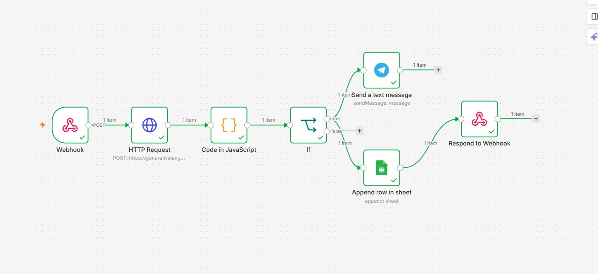
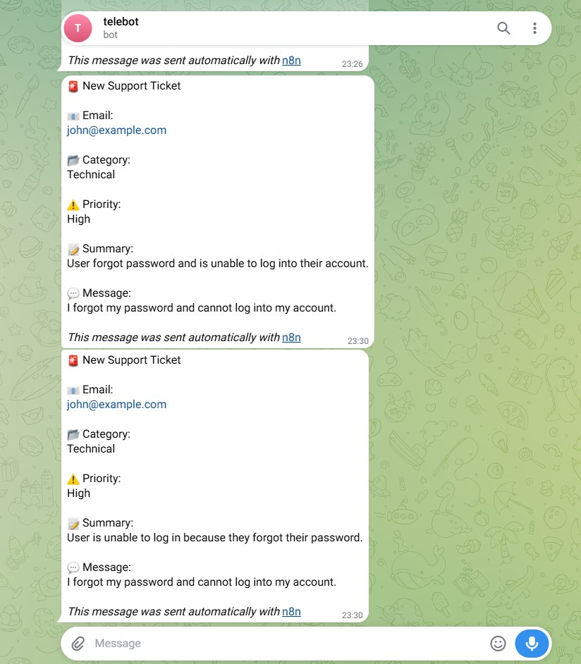
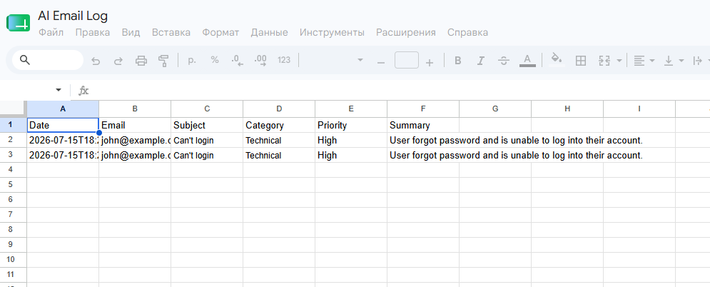

# AI Email Triage Assistant

## Overview

This project is an AI-powered email triage workflow built with **n8n**, **Google Gemini AI**, **Google Sheets**, **Telegram**, and **Gmail**.

The workflow automatically analyzes incoming emails, classifies them by category and priority, stores the results in Google Sheets, and sends Telegram notifications for high-priority emails.

---

## Business Problem

Companies receive dozens of emails every day.

Manually sorting and prioritizing them wastes valuable time.

This workflow automates email analysis using AI, helping teams respond faster to important messages.

---

## Features

- AI Email Classification
- Priority Detection
- Email Summary
- Google Sheets Storage
- Telegram Notification
- Gmail Integration
- Webhook/API Support

---

## Tech Stack

- n8n
- Google Gemini API
- Gmail
- Google Sheets
- Telegram Bot API

---

## Workflow

Gmail

↓

Gemini AI

↓

JavaScript Parsing

↓

Google Sheets

↓

If (High Priority)

↓

Telegram

↓

Webhook Response

---

## Example Input

```json
{
  "email": "john@example.com",
  "subject": "Cannot log in",
  "message": "I forgot my password and cannot access my account."
}
```

## Example AI Output

```json
{
  "category": "Authentication",
  "priority": "High",
  "summary": "Customer forgot password and cannot log in."
}
```

## Result

The workflow automatically:

- reads incoming emails
- classifies them with AI
- determines priority
- saves results to Google Sheets
- sends Telegram alerts for high-priority emails

---
## Screenshots

### Workflow



### Telegram



### Google Sheets


## Author

Built by Beksultan
